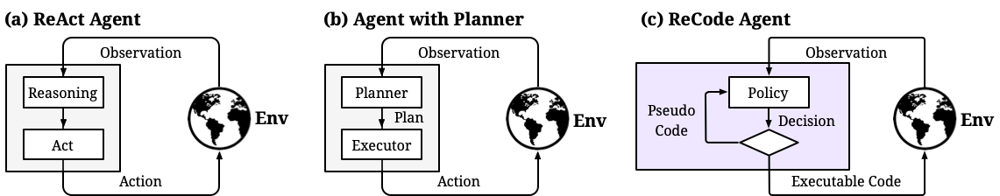
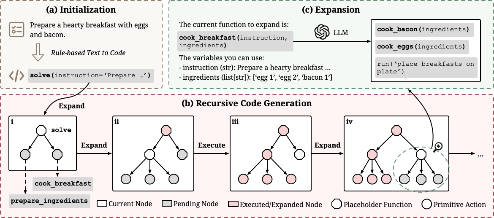
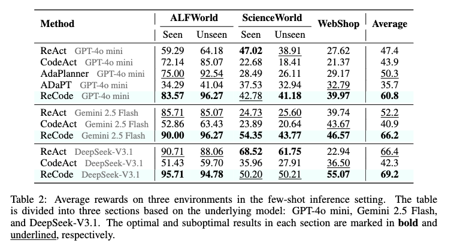
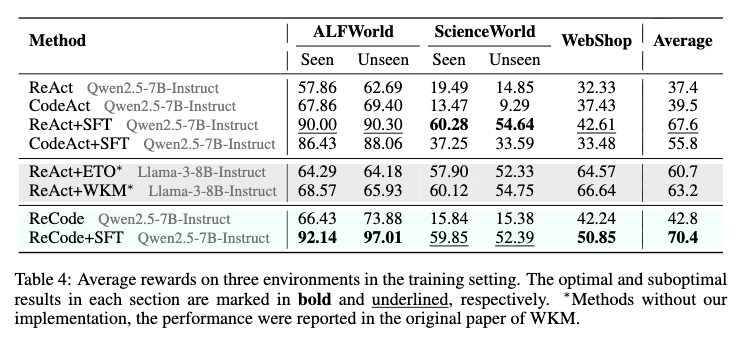

# ReCode: Unify Plan and Action for Universal Granularity Control

[](https://arxiv.org/abs/2510.23564)

> If you encounter any difficulties in using or reproducing the code, please contact me at [zhaoyangyu713@gmail.com](mailto:zhaoyangyu713@gmail.com).

ReCode introduces recursive code generation for LLM agents, unifying plan and action into a single representation. By treating high-level plans as placeholder functions that recursively decompose into executable primitives, it achieves universal granularity control and dynamically adapts from strategic thinking to concrete actions. This repository hosts the reference implementation used in the paper, along with environment wrappers and experiment tooling.

<p align="center">
<a href=""></a>
</p>

## Core Idea

ReCode adopts a divide-and-conquer strategy, decomposing complex tasks into executable code fragments:

1. **Tree-structured code**: Organizes partial programs in a tree where each node captures one sub-task and records its execution trace.
2. **Recursive expansion**: Placeholder functions are expanded by the LLM into more specific calls or smaller subroutines using environment-specific prompts and few-shots.
3. **Dynamic execution loop**: Each node is executed immediately; fresh observations decide whether to expand further, retry, or finish.
4. **Shared executor state**: A constrained Python executor maintains environment variables, validates code blocks, and exposes the toolset available to the agent.

<p align="center">
<a href=""></a>
</p>

## Repository Layout

- `run.py` – CLI entry point that instantiates agents/envs, manages concurrency, and writes run summaries.
- `agents/recode/` – ReCode agent implementation, prompt templates, and utility helpers.
- `envs/` – Environment wrappers and assets for `alfworld`, `webshop`, and `sciworld`.
- `configs/` – LLM profile templates and (expected) pricing metadata used by the async client.
- `utils/` – Shared components: async OpenAI wrapper, constrained executor, logging helpers, error types.
- `figures/` – Paper figures used throughout this README.

## Experiments

To evaluate the effectiveness of ReCode, we divide our experiments into the inference part and the training part.

1. **Inference Result**: we compare against several mainstream paradigm (ReAct, CodeAct) and some of the work focused on improving LLM-based agent planning (AdaPlanner and ADaPT). ReCode achieved significant performance improvements across all three environments, with an average score of 60.8, surpassing the best baseline method by 10.5 (relative 20.9%). _With our tests, ReCode can achieve a perfect **100** score in ALFWorld under `claude-4-sonnet`._


<p align="center">
<a href=""></a>
</p>

2. **Training Result**: we conduct supervised fine-tuning (SFT) on ReCode, ReAct and CodeAct with `Qwen2.5-7B-Instruct`. ReCode+SFT achieves a strong average performance of 70.4% across all environments, surpassing both ReAct+SFT (67.6%) and CodeAct+SFT (55.8%).

<p align="center">
<a href=""></a>
</p>


## Quick Start

We are refreshing this section and will publish the full walkthrough before **1 Nov (UTC)**.

## Configure LLM Access

- `configs/profiles.yaml` contains named profiles. The `run.py --profile` flag selects which profile to forward to `AsyncLLM`. Example:

  ```yaml
  models:
    default:
      api_key: "sk-your_api_key"
      base_url: "https://api.openai.com/v1"
      model: "gpt-4o-mini"
      temperature: 0.0
      track_costs: true
    gpt-4o:
      api_key: "sk-your_other_key"
      base_url: "https://api.openai.com/v1"
      model: "gpt-4o"
      temperature: 0.7
      max_tokens: 512
  ```

- Cost tracking loads `configs/prices.json`. If you do not want to record costs, set `track_costs: false` for the profile.
- As a fallback, you can omit the file and set `OPENAI_API_KEY` in the environment; the default profile will then use it.

## Environment Setup

### ALFWorld
- Install `alfworld` (already part of the Quick Start) and download the official dataset following the [ALFWorld instructions](https://github.com/alfworld/alfworld).
- Set `ALFWORLD_DATA` to the dataset root or edit `envs/alfworld/base_config.yaml` to point to your local paths:

  ```bash
  export ALFWORLD_DATA=/path/to/alfworld
  ```

- Optional filters such as `task_types` and `max_steps` can be supplied via YAML/CLI and are forwarded to `AlfworldEnv`.

### ScienceWorld
- Install `scienceworld` from the [ScienceWorld repository](https://github.com/allenai/ScienceWorld).

### WebShop
- Ensure `gdown` is installed.
- Run the provided helper to fetch the goal set and pre-built search index:

  ```bash
  bash envs/webshop/setup.sh
  ```

  The script downloads Google Drive archives, extracts them into `envs/webshop/data` and `envs/webshop/search_index`, and keeps the simulator under `envs/webshop/src`.
- `WebShopEnv` exposes knobs such as `max_steps` and `success_threshold` that can be overridden via config.

## Running ReCode

`run.py` is the canonical entry point. It resolves agent/environment aliases, manages concurrency, streams logs, and emits a structured summary.

```bash
# ALFWorld, single instance
python run.py -a recode -e alfworld -n 1 --split test --profile default

# WebShop, 3 test goals, allow deeper recursion
python run.py -a recode -e webshop -n 3 --split test --profile default --max-depth 12

# ScienceWorld, run 5 instances with 2-way concurrency
python run.py -a recode -e sciworld -n 5 -c 2 --profile gpt-4o
```

Key CLI flags:
- `-a / --agent` – class path or alias (`recode` resolves to `agents.recode.agent.ReCodeAgent`).
- `-e / --env` – environment class or alias (`alfworld`, `webshop`, `sciworld`).
- `-n / --instances` – number of evaluation episodes.
- `-c / --concurrent` – max concurrent episodes (rich progress UI automatically adapts).
- `--split`, `--seed`, `--max-depth`, `--profile` – forwarded to both agent and environment.
- `-C / --config` – YAML file whose keys override CLI flags; useful for complex sweeps.

Example YAML (`configs/example.yaml`):

```yaml
agent: recode
env: alfworld
instances: 10
concurrent: 2
profile: gpt-4o
split: test
task_types: ["put", "clean"]
max_depth: 12
max_retry: 4
```

Run it with:

```bash
python run.py -C configs/example.yaml
```

## Logging & Results

- Each run creates `logs/<run_id>/` with:
  - `running_logs/run.log` – aggregated stream of agent + environment logs.
  - `running_logs/instance_<id>.log` – per-instance traces (when multiple instances are launched).
  - `<results.json>` – structured summary written by `write_summary`, containing per-instance metrics and aggregated statistics (overall + per task type).
- The console prints a condensed summary (success rate, standard metrics, by-task breakdown) after completion.

## Extending to New Environments

1. **Implement the `Env` interface** under `envs/<your_env>/env.py`. Use `base.environment.Env` as the contract: implement `reset`, `_run`, `is_done`, `is_success`, and `report`. Return `{"observations": [...], "env_name": <name>, "env": self}` from `reset`.
2. **Expose prompts and guidance** in `agents/recode/resources/`:
   - `prompts/<env_name>/actions.txt` – concise description of valid `run("...")` calls/tools.
   - `fewshots/<env_name>/` – one or more `.txt` examples showing thought→execute patterns.
   - If your environment has task types, update `agents/recode/agent.py::_load_resources` and `agents/recode/utils.parse_raw_observation` to parse initial observations correctly.
3. **Register aliases** by adding your class to `ENV_ALIASES` in `run.py` (optional but convenient) and, if needed, plan-specific logic in the agent utilities.
4. Optionally add setup scripts (similar to `envs/webshop/setup.sh`) to document dataset fetching.

## Programmatic Use

You can embed the agent directly inside your own loop by reusing the provided utilities:

```python
import asyncio

from agents.recode.agent import ReCodeAgent
from envs.alfworld.env import AlfworldEnv

async def solve_once():
    config = {"split": "test", "task_types": ["put"], "max_depth": 10}
    env = AlfworldEnv(logger=None)
    agent = ReCodeAgent()
    init_info = env.reset(config)
    agent.reset(config, init_info)

    observations = init_info["observations"]
    while not env.is_done():
        actions = await agent.act(observations)
        observations = await env.run(actions)

    print(env.report())
    await env.close()

asyncio.run(solve_once())
```

The same pattern works for any `Env` implementation; be sure to pass a logger if you need file-backed traces.

## Citation

```
@misc{yu2025recodeunifyplanaction,
      title={ReCode: Unify Plan and Action for Universal Granularity Control}, 
      author={Zhaoyang Yu and Jiayi Zhang and Huixue Su and Yufan Zhao and Yifan Wu and Mingyi Deng and Jinyu Xiang and Yizhang Lin and Lingxiao Tang and Yingchao Li and Yuyu Luo and Bang Liu and Chenglin Wu},
      year={2025},
      eprint={2510.23564},
      archivePrefix={arXiv},
      primaryClass={cs.AI},
      url={https://arxiv.org/abs/2510.23564}, 
}
```
