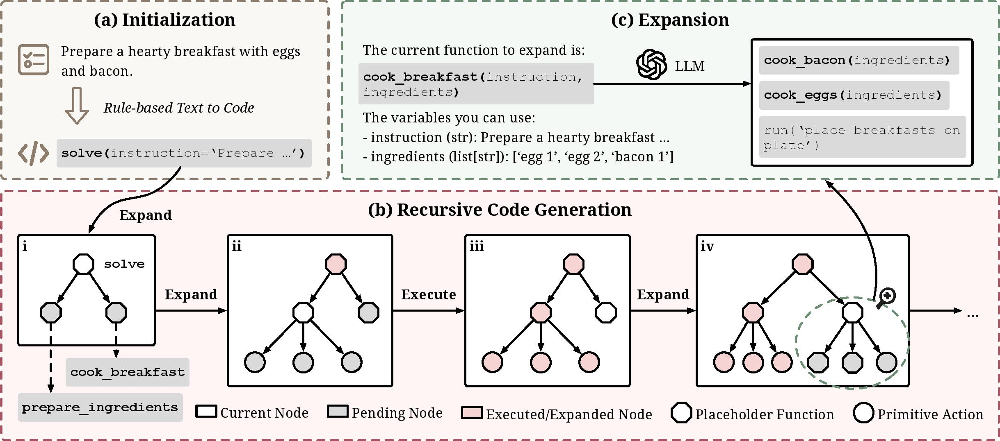

# ReCode: Unify Plan and Action for Universal Granularity Control

[](https://arxiv.org/abs/2510.23564)

ReCode is an agent paradigm based on recursive code generation that solves complex problems through progressive function expansion.

<p align="center">
<a href=""></a>
</p>

## Core Idea

ReCode adopts a divide-and-conquer strategy, decomposing complex tasks into executable code fragments:

1. **Tree-structured Code**: Organizes code nodes in a tree structure, where each node represents a subtask
2. **Recursive Expansion**: When encountering placeholder functions, the LLM automatically expands them into more specific implementations or smaller subtasks
3. **Dynamic Execution**: Executes code fragments in real-time and decides next steps based on execution results

## Core Components

- **CodeNode**: Code node containing code, status, thought process, etc.
- **Executor**: Code executor providing sandboxed environment for Python execution
- **LLM Expansion**: When placeholder functions are encountered, calls LLM to expand them
- **Environment Adaptation**: Supports multiple task environments

## Quick Start

We're still working on this section. Please check back later for updates.

## Usage Example

```python
# Initialize agent
agent = ReCodeAgent(task_type="alfworld")

# Reset and configure
agent.reset(config, {"env": environment, "env_name": "alfworld"})

# Execute task
result = await agent.act(["Your task is to: put a clean plate in fridge"])
```

## Citation

```
@misc{yu2025recodeunifyplanaction,
      title={ReCode: Unify Plan and Action for Universal Granularity Control}, 
      author={Zhaoyang Yu and Jiayi Zhang and Huixue Su and Yufan Zhao and Yifan Wu and Mingyi Deng and Jinyu Xiang and Yizhang Lin and Lingxiao Tang and Yingchao Li and Yuyu Luo and Bang Liu and Chenglin Wu},
      year={2025},
      eprint={2510.23564},
      archivePrefix={arXiv},
      primaryClass={cs.AI},
      url={https://arxiv.org/abs/2510.23564}, 
}
```